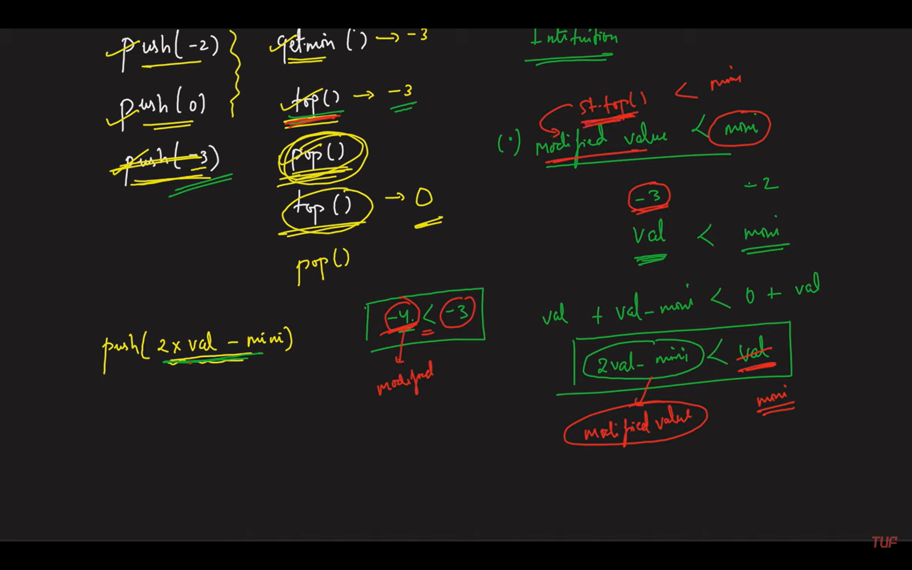
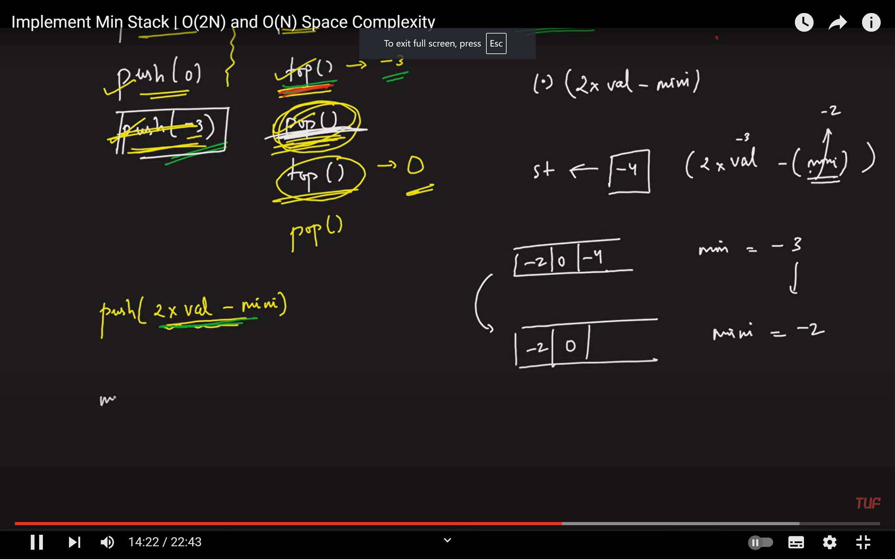
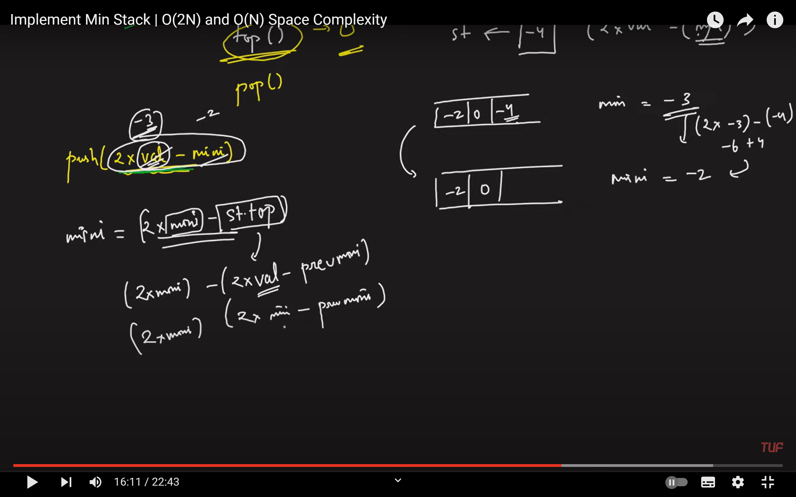

## Approach: 

Let’s take a variable that stores the minimum number. So whenever a push operation comes in just take that number put it in the stack and update the variable to the number.

Push operation:

Now if there is a push operation just check whether that number is less than the min number. If it is smaller than min we will push a modified value which is a push(2 * Val - min) into the stack and will update min to the value of the original number. If it’s not then we will just push it as it is.

getMin() operation:

We will just return the value of min.

Top operation:

While returning the top value we know that it is a modified value. We will check if the top value is lesser than min, If it is then we will return the min as the top value.

Pop operation:

While making pop we will check if the top value is lesser than min, If it is then we must update our min to its previous value. In order to do that min = (2 * min) - (modified value) and we will pop the element.

https://www.youtube.com/watch?v=V09NfaGf2ao

